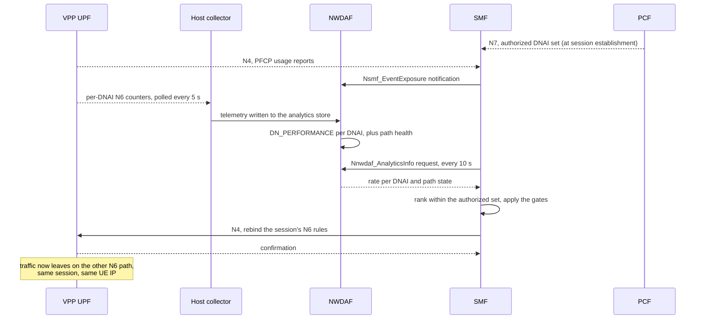

# OAI 5G Core with NWDAF-Driven Traffic Steering

Integration of **NWDAF** analytics into the **OpenAirInterface CN5G** control plane, so that
the core measures both of its data-network exit paths continuously and moves a **live PDU
session** from one to the other. The session is not re-established, no signalling reaches the
handset, and the UE keeps its IP address. Only the **N6** interface the traffic leaves on
changes.

---

## 1. Overview

A 5G core selects the exit point towards a data network once, when the PDU session is created,
and then leaves it alone. In 3GPP terms that exit point is a **DNAI** (Data Network Access
Identifier): the SMF picks one at session establishment, tells the UPF over **N4/PFCP**, and the
UPF programs its forwarding rules accordingly. Nothing in that exchange is periodic. The SMF has
no reason to revisit the choice, and the UPF has no way to report that the path has degraded.
Moving the session normally means tearing it down and building a new one, which the subscriber
notices.

3GPP already defines the analytic that would inform such a decision, **DN Performance** in
TS 23.288 clause 6.14, and names the SMF as its consumer. In a stock OAI deployment neither half
exists: the NWDAF does not compute it, and the SMF has no code that would read it.

This project builds both halves and connects them:

1. An extended NWDAF that measures each data-network path and publishes the result on the
   standard **Nnwdaf_AnalyticsInfo** northbound interface.
2. An SMF that discovers the NWDAF through the NRF, requests the analytic on a timer, ranks the
   DNAIs the policy allows for that subscriber, and reprograms the user plane over PFCP when it
   changes its mind.
3. A PCF that authorizes a **set** of DNAIs per subscriber rather than a single one, so the SMF
   has a legal choice to make.

The separation of responsibilities is the rule the whole design is built around:

> **The NWDAF proposes. The PCF authorizes. The SMF decides. The UPF enforces.**

The NWDAF services hold no session state and never contact the UPF. The PCF publishes the
permitted DNAI set but never picks one from it. The SMF is the only network function that both
decides and acts.

---

## 2. Repositories

| Component | Upstream | Role in this project |
|---|---|---|
| **Traffic steering project** | [TOSSI-Foundation/oai-nwdaf-ts](https://github.com/TOSSI-Foundation/oai-nwdaf-ts/tree/dnai_traffic_steering) | The deployable repository: NWDAF services, NF patches, topology, automation |
| **NWDAF** | [oai-cn5g-nwdaf](https://gitlab.eurecom.fr/oai/cn5g/oai-cn5g-nwdaf) | Extended: new analytics, NRF registration, subscription handling |
| **SMF** | [oai-cn5g-smf](https://gitlab.eurecom.fr/oai/cn5g/oai-cn5g-smf) | Patched: analytics consumer, DNAI selection, PFCP actuation |
| **PCF** | [oai-cn5g-pcf](https://gitlab.eurecom.fr/oai/cn5g/oai-cn5g-pcf) | Patched: AF routing requirement handling, NRF heartbeat fix |
| **NRF** | [oai-cn5g-nrf](https://gitlab.eurecom.fr/oai/cn5g/oai-cn5g-nrf) | Patched: NWDAF discoverability, registration compatibility |
| **Deployment** | [oai-cn5g-fed](https://gitlab.eurecom.fr/oai/cn5g/oai-cn5g-fed) | External prerequisite, not vendored: subscriber database and compose baseline |

The OAI network functions are **not vendored**. Each change is kept as a patch that names the
exact upstream commit it applies to, so the difference between upstream and this work is one
`git apply` away and a newer OAI release is a rebase rather than a fresh start.

---

## 3. What changed

### 3.1 SMF: consumer, decision and actuation

The SMF carries the bulk of the new work and is the only network function that both decides and
acts. Three capabilities were added.

**It became an NWDAF consumer.** The SMF discovers the NWDAF through the NRF and issues a
request and response analytics query on a fixed cadence, every ten seconds by default. Request
and response was chosen over subscribe and notify because it is consumer-timed, needs no inbound
callback endpoint on the SMF, and is stateless across NWDAF restarts. The analytic requested in
this deployment is the standard `DN_PERFORMANCE`. The SMF deliberately does not request the
project's own vendor analytics ID, because a network function must not treat a vendor extension
as a standard analytic.

**It gained per-session DNAI selection.** For each active session the SMF intersects what the
NWDAF measured with the DNAI set the PCF authorized for that subscriber, ranks the survivors
under the configured rule, and either selects a new DNAI or holds. Where a session's policy
contains more than one rule, the SMF selects within the governing rule, the one with the lowest
precedence value, and never across rules. A hold is a normal outcome rather than an error, and
the reason is logged.

**It gained SMF-initiated actuation.** Upstream OAI declares an SMF-requested session
modification procedure but never constructs or triggers one, so there was nothing to hang an
internally generated decision on. The patch adds the path from an internal decision to a PFCP
session modification that rebinds the session's N6 rules to the other network instance. Two
properties of that actuation matter architecturally:

1. **The uplink and downlink rules must move together.** The forwarding rule that selects the
   egress instance and the detection rule that matches returning traffic live on the same N6
   edge. Updating only the first moves egress to the new path while the downlink still matches
   the old one, and return traffic is silently dropped.
2. **The SMF tracks the DNAI the UPF has confirmed**, not the one it intended. A PFCP update that
   failed is rolled back to the last confirmed state rather than being remembered as a success,
   so the SMF's view of the user plane cannot drift away from reality.

Two ranking rules ship. One is selected by configuration when the SMF container starts and is
fixed for the life of that container.

| | RATE | HEALTH |
|---|---|---|
| Ranks on | Offered load, from the standard `avgTrafficRate` field | Observed path state, from the vendor path-health extension |
| Moves a session | Toward the busier authorized path | Away from a path observed to be degraded |
| Reaction time | Bounded by the analytics averaging window, minutes | Seconds |
| Reversible | No | Yes |
| Default | Yes | No |

`RATE` reproduces the straightforward interpretation of the standard field and is the shipping
default. It ranks on *offered load*, not on path quality, so it steers toward the busier path and
cannot move a session back once traffic has converged.

`HEALTH` is the rule intended for operational use. It acts only on a path it has actually
observed to be degraded, and it reads the DNAI the UPF has confirmed rather than the one the SMF
intended. It treats an unobservable path as unknown rather than as bad, excludes a candidate that
is degraded now or was degraded recently so that sessions do not immediately steer back, and
prefers a path known healthy over one it knows nothing about.

Both rules are project-specific. TS 23.288 defines the analytic; it does not define how a
consumer should rank DNAIs on it.

### 3.2 PCF: authorization of a DNAI set

The PCF is the authorization authority in this design. It publishes which DNAIs a subscriber may
use and never selects among them.

Its policy data is provisioned as three linked parts: named policy rules, the traffic control
entries those rules reference, and a mapping from each subscriber identity to a rule. A traffic
control entry may list several DNAIs, which is what TS 23.503 describes as "a set of DNAI(s) the
SMF needs to consider for UPF selection/reselection". Provisioning a rule that lists both N6
DNAIs is what gives the SMF a set to select within, and it is configuration rather than a code
change. A subscriber whose rule names one DNAI is never steered.

The patch to the PCF concerns the other way a DNAI set can arrive, from an application function.
Upstream, the policy authorization path built a decision object and never populated it, so an AF
routing requirement was silently dropped and the notification sent to the SMF carried the
unchanged policy. The patch turns an AF routing requirement into the traffic control entry and
the referencing policy rule that the SMF actually consumes, installed at a precedence that
outranks a provisioned steering rule. This is what makes an AF-driven path change reach the user
plane at all.

A second PCF patch is unrelated to steering but not optional. The upstream PCF logs a successful
NRF registration and then stops maintaining it, disappearing from the NRF about a minute after
every start. The SMF can then no longer discover it, no session receives a policy rule, no DNAI
is authorized, and steering silently never happens with no error anywhere. The patch restores the
periodic registration refresh, sends it in the format TS 29.510 requires, and retries rather than
giving up permanently after a single failure.

### 3.3 NRF: making the NWDAF findable

TS 23.288 expects a consumer to find an NWDAF through the NRF by NF type. Upstream OAI never
assigned the NWDAF NF type when converting a registration into its internal profile, so an NWDAF
profile was stored as an unknown type and a discovery query for it returned nothing. The patch
assigns the type, which is what allows the SMF to discover the NWDAF at runtime instead of being
pointed at a hardcoded address.

A second, smaller change accepts the service-name spelling that the published OAI AMF image
actually registers with. Without it the AMF's registration is rejected, and it retries
indefinitely, leaking a socket on each attempt.

### 3.4 NWDAF: the analytics that did not exist

The upstream OAI NWDAF computes UE communication, UE mobility and network performance analytics.
None of them describe a data-network path, so none of them can rank one exit against another.
Four services are deployed, all extended here.

| Service | Role |
|---|---|
| Southbound interface | Subscribes to SMF and AMF event exposure and stores what it receives |
| Engine | Computes the analytics from the stored data, including `DN_PERFORMANCE` |
| Analytics northbound interface | Serves `Nnwdaf_AnalyticsInfo`, and is what the SMF polls |
| Events northbound interface | Serves `Nnwdaf_EventsSubscription`. Deployed, but nothing on the steering path consumes it |

**A `DN_PERFORMANCE` analytic was implemented.** It is the only standard analytic whose output is
per-path: each entry is scoped by data network and DNAI, and TS 23.288 names the SMF as the
consumer. It is computed by joining the PFCP usage reports the NWDAF receives through SMF event
exposure to the DNAI the session was on at the time each report was produced, and averaging the
resulting traffic rate over a configurable window.

**Two further standard analytics were added**, NF load and QoS sustainability, both computed from
the same collected data. NF load is the analytic the SMF consumer originally requested. It was
retained but proved structurally unable to rank two paths, because both DNAIs are network
instances of the same UPF NF instance and therefore report one shared load figure.

**Fields that cannot be measured are absent, not zero.** Packet delay and packet loss are not
produced. The UPF plugin in this deployment does not implement the TS 29.244 QoS-monitoring
information elements, and PFCP usage reports carry volume, packet counts and duration but no loss
counter. Reporting zero would assert a measurement that was never taken.

**Path health is carried as an explicit vendor extension.** Because delay and loss are not
available, path degradation is derived instead from the UPF's own per-DNAI N6 interface counters,
specifically the transmit stalls at the boundary between the user plane and the host interface.
It counts stalls rather than discarded packets, so it is not packet loss, and it is carried under
a vendor-prefixed key **outside** the standard analytics object precisely so that no consumer can
mistake it for a 3GPP metric. It is path-scoped rather than session-scoped, which means it exists
for a DNAI carrying no session at all.

**Supporting changes** make the above usable in a live deployment. The analytics service now
registers itself with the NRF so the SMF can discover it. The southbound service manages its
event-exposure subscriptions to the SMF and AMF explicitly, rather than assuming a subscription
made once stays valid across peer restarts. Usage reports are de-duplicated and their retention
bounded, so a repeated report or an unbounded history cannot distort a rate.

### 3.5 Deployment topology and host processes

The deployment gives one VPP UPF **two independent N6 network instances**, which is what steering
moves a session between. Because the UPF keeps a separate forwarding table per network instance,
the two paths are genuinely distinct rather than two labels for one egress.

| Path | DNAI | UPF network instance | Interface | Subnet |
|---|---|---|---|---|
| Primary | `internet-primary` | `internet.oai.org.pri` | `n6-3` | `192.168.73.0/24` |
| Secondary | `internet-secondary` | `internet.oai.org.sec` | `n6-4` | `192.168.74.0/24` |

Two processes run on the host, outside any container, and both are required.

| Process | Why it exists |
|---|---|
| Telemetry collector | Polls the UPF's per-DNAI interface counters and its resource usage every five seconds and writes them to the analytics store. It runs on the host because it reads the UPF's own control CLI and the container's cgroup accounting directly. Without it every path reads unknown and health-based steering can never fire. |
| Data-network route synchroniser | Keeps the external data network's per-UE return routes in step with the path each session is actually on, read from the UPF's own forwarding state. Without it a steer moves egress successfully and the replies come back on the old path, where they match nothing. |

The route synchroniser is **lab scaffolding, not part of 3GPP traffic steering**. A real
deployment would advertise the UE prefix out of the active N6 and let routing converge; the lab's
static data network cannot learn that a session moved.

---

## 4. Architecture


Every interface in the loop is standard except one. The UPF is not a service-based network
function: it speaks PFCP to the SMF and forwards user traffic, and exposes no interface of its
own. TS 23.288 does not define how an NWDAF collects measurements from a UPF, so anything the UPF
knows reaches the NWDAF either through the SMF or out of band.

| Interface | Between | Carries |
|---|---|---|
| N4 · PFCP | UPF and SMF | Usage reports from the UPF, and the rule updates that move a session back to it |
| N7 | PCF to SMF | The authorized DNAI set, delivered at session establishment and held per session |
| Nsmf_EventExposure | SMF to NWDAF | Usage reports and user-plane path change events |
| Namf_EventExposure | AMF to NWDAF | Registration and mobility events, collected but not used by the steering decision |
| Nnwdaf_AnalyticsInfo | NWDAF to SMF | The `DN_PERFORMANCE` result, polled by the SMF |
| Nnrf_NFManagement | All NFs and the NRF | Registration and discovery |
| N11 | AMF and SMF | PDU session establishment and modification. Unchanged, and no part of the steering loop |
| Out of band, not an interface | UPF to host collector | Per-DNAI N6 interface counters and resource usage, read from the UPF's own control CLI and the container's host accounting. This is where path health comes from |

### The control loop



The loop closes because the actuation changes what the next measurement sees.

Between a decision and an actual steer sit several gates, and each of them can only ever withhold
a move, never cause one:

1. The target DNAI is re-checked against the session's PCF decision at execution time, because the
   decision was taken on another thread and the policy may have been revoked since. This is a
   re-check of the authorization the SMF already holds, not a fresh policy request.
2. A per-cycle budget allows at most one steer per evaluation cycle across the whole engine. This
   applies under both rules, and it is what stops every session on a degraded path migrating
   together in the same cycle.
3. Under the health rule, a per-session cooldown prevents the same session moving twice in quick
   succession.
4. Where the target carries path health, that health must have been observed *after* the previous
   steer took effect, which is what makes this a closed loop rather than merely a rate-limited
   one. The rate rule carries no health, so it is held by the budget alone.

The cadences are short except one. The UPF reports usage roughly every ten seconds, the host
collector polls every five, and the SMF requests analytics every ten. The exception is the
analytics averaging window, five minutes by default, which dominates how the rate-based rule
behaves: a step change in offered load is diluted by the older samples still inside the window.
Path health is not averaged that way. It is a verdict per collection interval, accepted only
while it is fresh, which is why the health rule reacts in seconds where the rate rule takes
minutes.

---

## 5. Deployment guide

The repository ships a `make` wrapper over its scripts; every target is a script that can also be
run directly.

**Prerequisites.** Linux with Docker Engine 24 or newer, Docker Compose as a separate package,
passwordless `sudo` (the host pollers start non-interactively and fail rather than prompt), and
roughly 8 GB RAM with 40 GB free disk. No Go or C++ toolchain is needed on the host, as every
compiler runs in a container. `oai-cn5g-fed` is required and is cloned at a pinned commit by the
build; it supplies the subscriber database, without which no UE can authenticate.

**1. Verify the checkout.**

```bash
make verify
```

Compiles the services, checks that every patch still applies to the commit it names, and parses
every script and configuration file, entirely in temporary directories and throwaway containers.
It is safe to run against a live deployment. It proves the repository builds; it cannot prove that
steering works.

**2. Build the images.** Nothing is published to a registry.

```bash
make build-nwdaf      # the four NWDAF Go services
make build-gnbsim     # the UE simulator
make build-fed        # oai-cn5g-fed at a pinned commit, plus this project's configuration
make build-nfs        # SMF, PCF and NRF from source
```

The Go services and the simulator build in minutes. The three C++ network functions are full
from-source builds and are the slow part; budget several hours on a first run. Everything else is
pulled unmodified.

**3. Bring the system up, in order.** Each step checks that the previous one succeeded.

```bash
make core RULE=HEALTH     # the 5G core, the PCF, and the steering SMF
make nwdaf                # the NWDAF stack and the two host pollers
make ues UES=5 ANCHORS=1  # attach the UEs and start the NWDAF southbound service
```

The ranking rule is fixed on the SMF container, so switching rules means recreating the core.

**Steerable UEs and anchors.** Steerable UEs start on the primary path and may be moved. The last
*N* containers are **anchors**: pinned to the secondary path and never steered. An anchor exists
so the secondary path stays measurable. A path that carries no session only ever reads unknown,
and neither rule then has two paths to compare.

Before running anything else, confirm that all five network functions are registered with the NRF.
`make status` then shows where each session is and which rule is in force.

---

## 6. Verify and demo

Two automated tests ship, each ending in a single PASS or FAIL line. They need different traffic
shapes and each needs its own core bring-up.

**Health-based steering.** With traffic running on every UE, the test records a baseline, then
applies a rate limit to the N6 interface of whichever path is carrying the most sessions, inside
the UPF's network namespace. The collector observes stalls within about five seconds, the SMF
selects an alternative on its next poll and reprograms the UPF, and the test confirms the move by
re-reading the UPF's own session table. The impairment is removed on every exit path, including an
interrupt.

```bash
make load MBPS=60 SECS=1800 PROTO=udp
make test-health
make unsteer
```

A pass requires four independent assertions: the impaired path was reported degraded, the SMF
selected the expected alternative, at least one session changed network instance **in the UPF**,
and no more than one steer occurred in any single cycle.

UDP matters here. A rate-limited TCP flow collapses and dies, which presents as "no traffic"
rather than as a degraded path, so the path reports unknown and nothing steers.

**Rate-based steering** needs the opposite shape: load on the anchor sitting on the secondary
path, with the steerable UEs on primary left idle. Secondary then reports the higher rate and the
primary sessions migrate onto it. No impairment is involved. A pass additionally requires the move
to have gone *toward* the highest-rate path, which is what makes it a test of the rule rather than
a test that something moved. If every session is already on one path the test stops and says so,
rather than reporting a pass it cannot justify.

**Checking the result properly.** A script's exit code is not proof, and neither is a log line,
because the log says what the SMF *decided*. The UPF's forwarding state is the only authority on
what happened. For the same session, two things must both be true:

| Check | Meaning |
|---|---|
| The network instance changed | The traffic really moved to the other N6 path |
| The **UE's IP address did not change** | The session was steered, not re-established |

The second check is the whole claim of the project. If the address changed, the session was
re-established rather than steered, and the result does not demonstrate what it appears to.

The analytic can be read exactly as the SMF sees it, from the analytics northbound interface, and
the SMF's decision log shows the path health it received, the per-session selection against the
PCF-authorized set, the cycle summary, and the PFCP update it pushed. A steady stream of hold
decisions against healthy paths is correct behaviour, not a fault.

---

## 7. Reference

**Specifications.** TS 23.288 (NWDAF architecture and analytics; clause 6.14 for DN Performance,
clause 5.2 for discovery), TS 29.520 (the `Nnwdaf_AnalyticsInfo` API and its data model),
TS 29.508 and TS 29.518 (SMF and AMF event exposure), TS 29.510 (NRF management), TS 23.503
(policy framework and AF influence on traffic routing), TS 29.512 and TS 29.514 (SM policy control
and policy authorization), TS 29.244 (PFCP), TS 23.502 clause 4.3.5 (user-plane path
reselection).

**Upstream.** Built on [OpenAirInterface CN5G](https://gitlab.eurecom.fr/oai/cn5g). The NWDAF
services are modified from `oai-cn5g-nwdaf`; the SMF, PCF and NRF are patched from their own
upstream repositories at pinned commits; AMF, UPF-VPP, AUSF, UDM and UDR are used unmodified.
`oai-cn5g-fed` supplies the deployment prerequisites. Licensed under CSSL v1.0.

The UE credentials used throughout the deployment are OpenAirInterface's public tutorial test
vectors, not secrets.
