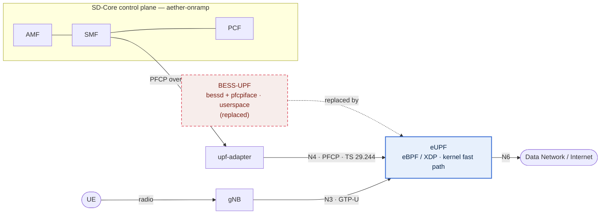
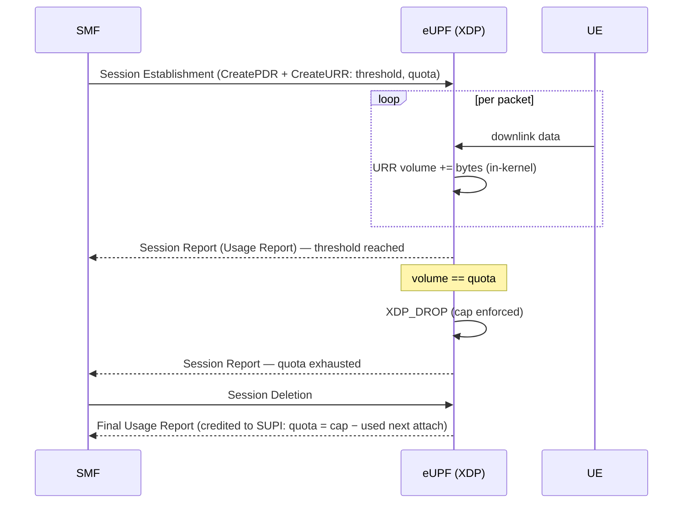

# SD-Core × eUPF — XDP Datapath with In-Kernel Usage Metering (URR)

Integration of **SD-Core** (open-source 5G core) with **eUPF**, an **eBPF/XDP** user
plane — replacing SD-Core's default BESS user plane — plus **URR (Usage Reporting)**:
subscriber data is metered and capped **in the kernel fast path**, with the cap set from
the SMF and enforced per subscriber.

---

## 1. Overview

A 5G Standalone core follows **CUPS** (Control/User Plane Separation): the **SMF** decides
session policy, the **UPF** forwards subscriber packets, and they talk over **N4/PFCP**
(TS 29.244). SD-Core ships a **BESS** user plane that runs in userspace and installs no
URR — so it never measured or capped data. This integration:

- runs the user plane on **eUPF (eBPF/XDP)** — packets are classified and forwarded
  **inside the Linux kernel**, before the network stack;
- adds **URR metering + quota enforcement** end-to-end: the SMF installs a URR at PDU
  session establishment (configurable via `smfcfg`), and eUPF meters volume and **drops
  traffic in-kernel** when the quota is hit;
- adds **per-subscriber persistent accounting** so a cap survives re-attach (a new session
  / new IP doesn't reset it — it's keyed by SUPI);
- ships a small **live dashboard** (`scripts/urrmon`) that reads eUPF's REST API.

## 2. Repositories

| Component | Repo | What we changed |
|---|---|---|
| **SMF** | https://github.com/Shiva-Marshall/sdcore-smf-urr-implemented | URR install (config-driven) + per-subscriber accounting — see its `URR-SUPPORT.md` |
| **eUPF** | https://github.com/Shiva-Marshall/eUPF-enhanced | URR datapath + fixes + the `scripts/urrmon` dashboard — see its `ENHANCEMENTS.md` |

## 3. Base versions (this deployment)

| Piece | Version |
|---|---|
| Kubernetes | RKE2 `v1.35.3+rke2r3` (single node) |
| CNI | Canal/Calico + Multus |
| SD-Core (via **aether-onramp**) | NFs `rel-3.0.0` · AMF `rel-3.1.0` |
| upf-adapter | `rel-2.1.3` |
| **eUPF** | Helm chart `0.5.0` · image `eupf:dev-urrsdf` *(our build)* |
| **SMF** | image `sdcore-smf:urracct2` *(our URR + accounting build)* |
| RAN | UERANSIM (gNB + UE) in a Linux netns |

> SD-Core is brought up with the **aether-onramp** deployment (Helm `sd-core` chart); the
> **BESS UPF is replaced by the eUPF Helm chart**. The SMF still speaks PFCP, bridged by
> the **upf-adapter** over N4 — same interface, eBPF/XDP engine.

## 4. What we changed

### SMF (control plane)
- Attaches a **`CreateURR`** to the downlink PDR at session establishment (Measurement
  Method, Reporting Triggers, Volume Threshold, Volume Quota).
- **Config-driven** via `smfcfg` → `configuration.urr` (`enable`, `volumeThresholdBytes`,
  `volumeQuotaBytes`).
- **Per-subscriber accounting**: consumes the URR Usage Reports, keeps a running
  `usedBytes` per **SUPI** in Mongo (`sdcore_smf` → `smf.data.subUsage`), and installs
  `quota = cap − used` on the next attach — so airplane-mode / re-attach doesn't reset the cap.
- Files: `factory/config.go`, `context/pfcp_rules.go`, `context/upf.go`,
  `context/datapath.go`, `context/urr_usage.go`, `pfcp/message/build.go`,
  `pfcp/adapter/adapter.go`, `pfcp/handler/handler.go`.

### eUPF (datapath)
- URR **byte/packet metering** in XDP + `/api/v1/urr_map`.
- URR **volume threshold** → PFCP Session Report Request; **volume quota** → in-kernel drop
  (`XDP_DROP`); enriched **final Usage Report** on deletion.
- Fixes so real (SMF-installed) URRs actually meter: **URR ids wired into the eBPF PDR map**
  and applied to **SDF-filtered PDRs**.
- Also: PFCP **Association Release**, GTP-U path monitoring, PFD management, downlink buffering.
- The `scripts/urrmon` live dashboard.

## 5. Architecture



**URR lifecycle** (measure → threshold → enforce → report):



*(A detailed native-XDP/SR-IOV architecture image can be added here as `architecture.png`.)*

## 6. Deployment guide

> Assumes a single-node **RKE2** cluster and the **aether-onramp** repo checked out.

**1 — Deploy the SD-Core control plane (aether-onramp).**
Bring up SD-Core with aether-onramp (Helm `sd-core` chart), namespace `aether-5gc`.

**2 — Replace the BESS UPF with eUPF.**
Disable/skip the BESS `upf` and deploy the **eUPF Helm chart** (`0.5.0`) with our image
`eupf:dev-urrsdf`. eUPF runs its Go control plane (PFCP :8805, REST :8080) + the XDP
datapath. Ensure `enableUPFAdapter: true` on the SMF so PFCP is bridged by the upf-adapter.

**3 — Build & deploy the modified SMF.**
```bash
# in the SMF repo
docker build -t sdcore-smf:urracct2 .
# import into the cluster's containerd (RKE2 socket) and set the image:
docker save sdcore-smf:urracct2 | sudo ctr --address /run/k3s/containerd/containerd.sock -n k8s.io images import -
kubectl -n aether-5gc set image deploy/smf smf=docker.io/library/sdcore-smf:urracct2
```

**4 — Enable URR in `smfcfg`.**
```yaml
configuration:
  urr:
    enable: true
    volumeThresholdBytes: 943718400    # 900 MiB  (early-warning report)
    volumeQuotaBytes:    1073741824    # 1 GiB    (hard cap)
```
Apply and restart the SMF; re-establish the PFCP association (**restart upf-adapter, then
smf** — the SMF caches the UPF IP).

**5 — Host routing glue (pod-based eUPF).**
Because eUPF is a pod, route the UE pool to it from the host (policy routing) and NAT the
uplink — re-applied whenever the eUPF pod IP changes:
```bash
ip route replace <UE-pool> via <eUPF-pod-IP> dev <cali-veth> table 200
ip rule add to <UE-pool> lookup 200
iptables -t nat -A POSTROUTING -s <UE-pool> -j MASQUERADE
```

**6 — Bring up the RAN.**
Start UERANSIM `nr-gnb` then `nr-ue` in the `ran` netns.

## 7. Verify / demo

- **eUPF-side** — installed URR + counters:
  `curl http://<eUPF>:8080/api/v1/pfcp_sessions` and `.../api/v1/urr_map`.
- **Cap test** — drive downlink traffic through the UE; usage climbs, crosses the
  threshold, and is **CAPPED** (traffic dropped in-kernel) at the quota.
- **Accounting** — deregister (airplane mode) and re-attach: the new session installs the
  **remaining** quota (`cap − used`), so the cap is not reset.
- **Dashboard** — `python3 scripts/urrmon/urrmon.py --serve` → `http://<host>:8088`
  (per-subscriber usage-over-time, status OK/THRESHOLD/CAPPED).

## 8. References
- 3GPP **TS 29.244** — PFCP (PDR/FAR/QER/URR)
- SD-Core — https://github.com/omec-project
- eUPF — https://github.com/edgecomllc/eupf
- aether-onramp — https://github.com/opennetworkinglab/aether-onramp
